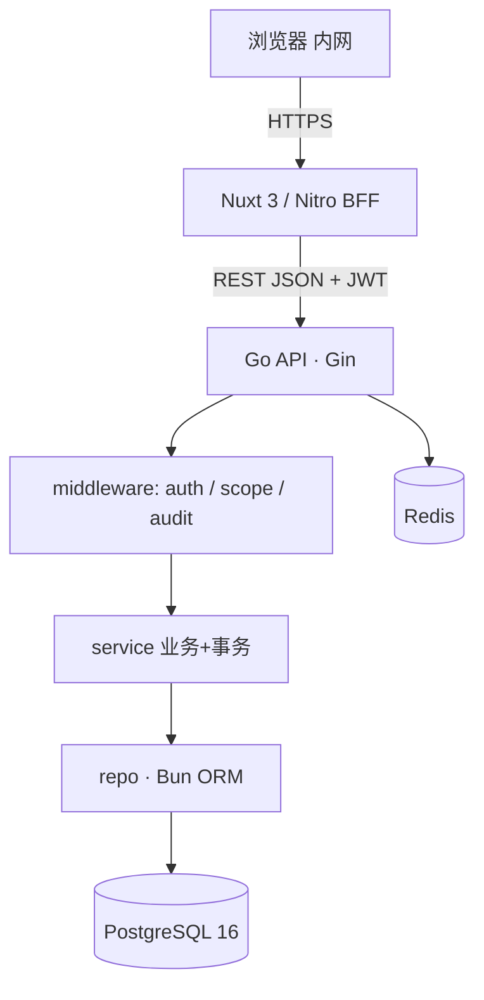
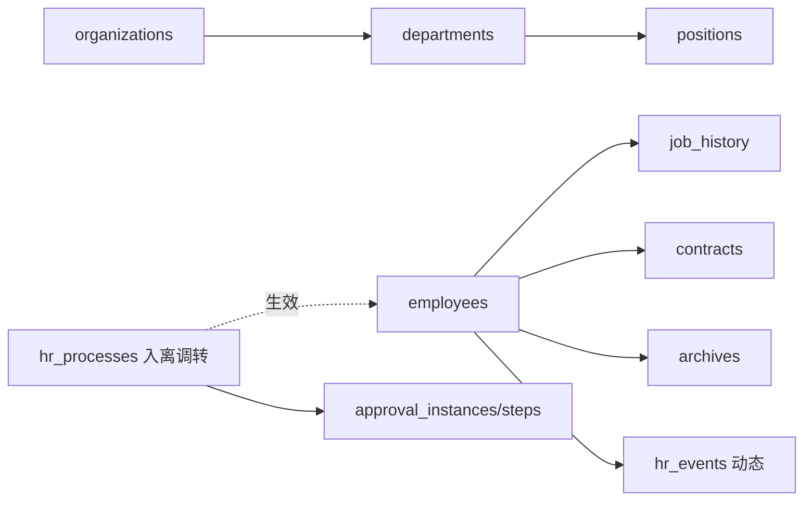
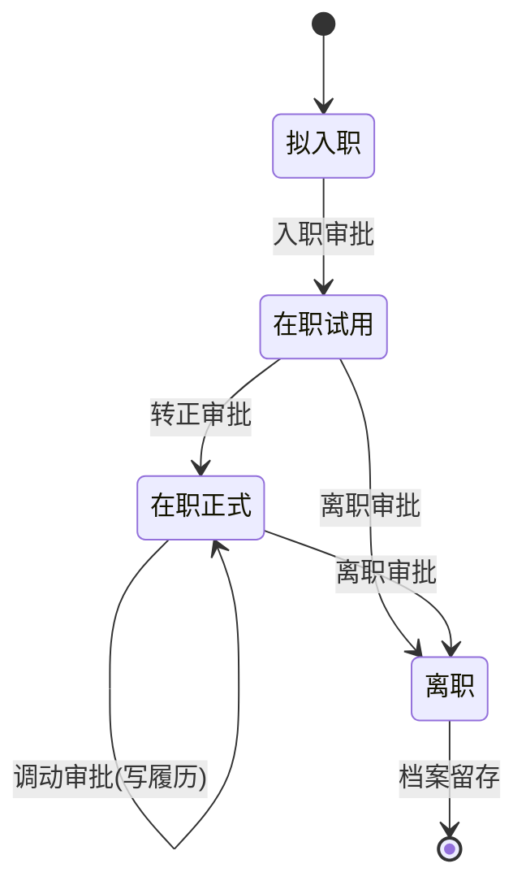

# 组织人事管理系统 · OrgHR

### 全栈考核 —— 组织人事模块 从 0 到 1

规划汇报 v0.1 ｜ 2026-06-10 ｜ XXX

Nuxt 3 · Go(Gin+Bun) · PostgreSQL 16 · Redis · 设计参考 huashu-design

---

## 考核要点 → 我的应对

| 考核维度 | 应对 |
| --- | --- |
| 端到端闭环能力 | 1 条「录入→流程→审批→留痕→可视化」全链路可演示 |
| 产品结构设计 | 角色/信息架构/10 域拆解/状态机/RBAC（`docs/01`） |
| 技术方案合理性 | 复用参考工程后端约定，按需裁剪（`docs/02`） |
| 工程规范 | 提交/目录/Lint/DoD（`docs/07`） |
| 可扩展性 | 多组织树 / RBAC / 审计 / 统一分页错误码 |

核心：宁可少而完整，不要多而半成品。

---

## 范围 · 10 大功能域（全量铺开）

- **① 组织架构管理** · P0
- **② 员工花名册** · P0
- ③ 档案库 · P1
- **④ 入离调转管理** · P0
- ⑤ 合同管理 · P1
- ⑥ 任职奖惩 · P1
- ⑦ 员工关怀 · P2
- **⑧ 统计分析** · P0
- ⑨ 人事报表 · P2
- **⑩ 人事动态** · P0

P0 可交互演示 ｜ P1 打通主链路 ｜ P2 页面骨架 + 数据结构 + 1 个动作

---

## 系统架构

- 后端按业务域分包 `internal/<module>`（handler/service/repo/models/router）
- 树用 materialized path · Snowflake ID · 软删 · 审计中间件

---

## 数据模型 · 以「员工」为主数据

流程生效 = 一个事务：更新 employees + 写 job_history + 写 hr_events + 更新流程状态

---

## 核心闭环 · 员工生命周期

每次状态迁移：①更新主数据 ②追加任职履历 ③生成人事动态 ④写审计日志

---

## 设计方向 · huashu-design 两段式

**1. 方向探索**
用 huashu-design 出 3 版高保真原型
（工作台 / 花名册 / 档案 / 架构图 / 审批 / 看板）

**2. token 固化**
抽色板/字阶/间距/圆角/动效

**3. 生产落地**
映射为 Nuxt + Tailwind 主题

**基调**：专业 · 可信 · 克制
低饱和主色 · 充裕留白 · 数据可读
**反 AI slop**：不堆渐变/玻璃/霓虹/无意义动效

---

## 计划与降级砍线

**里程碑**
- M1 地基 + 鉴权
- M2 组织 / 花名册 / 审批闭环 / 动态
- M3 统计看板 + 工作台
- M4 合同/档案/奖惩/关怀/报表
- M5 部署 + README + 演示

**Cut Line（从下往上砍）**
- ✅ 登录 + 组织树 + 花名册
- ✅ 一条审批闭环 + 留痕
- ✅ 统计看板（≥3 图）
- ✅ 可访问 URL + README
- ⬇ 定时推送 / PDF / 报表设计器

---
layout: center
class: text-center
---

## 演示要点

发起调动 → 审批通过 → 员工部门变更 ✓ 履历新增 ✓ 动态新增 ✓ 审计留痕 ✓ 看板联动 ✓

文档全集见 <code>docs/</code> · 00 总览 / 01 产品 / 02 架构 / 03 数据 / 04 接口 / 05 设计 / 06 计划 / 07 规范

谢谢 🙌

